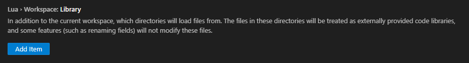

# Foundation LuaCats Meta Library

This repository provides comprehensive [luacats](https://github.com/Benjamin-Dobell/luacats) meta files for the [Foundation](https://www.polymorph.games/foundation/) game modding API. These meta files are designed to enhance the Lua development experience for Foundation modders by enabling advanced autocomplete, type hinting, and inline documentation in editors such as [VS Code](https://code.visualstudio.com/) with [sumneko/lua-language-server](https://github.com/sumneko/lua-language-server).

---

## Features

- **Full API Coverage:** Includes all core classes, enums, and asset types from the Foundation modding API.
- **Rich Type Annotations:** Provides detailed type hints, inheritance, and field documentation for all major Foundation data types.
- **Editor Integration:** Works out-of-the-box with popular Lua language servers for VS Code and other editors.
- **Hand-Tuned Accuracy:** Generated files were heavily tuned and modified beyond the initial scripts to ensure correctness and usability.

---

## Getting Started

1. **Clone or Download** this repository to a centralized location on your system where you keep common libraries.
2. **Configure your Lua language server** (e.g., sumneko or EmmyLua) to include the `meta/` directory in your workspace's library paths. [Detailed Instructions](#adding-the-meta-library-to-your-vs-code-workspace)
3. **Enjoy enhanced autocomplete and documentation** as you write Foundation mods in your editor.

---

## Adding the Meta Library to Your VS Code Workspace

1. **Clone this Repository:**  
   First, clone this repository to a centralized location on your system where you keep common libraries. For example:

   ```bash
   git clone https://github.com/Spinnernicholas/polymorph-foundation.git C:\Libraries\polymorph-foundation
   ```

2. **Open Your Mod Project Workspace:**  
   Launch VS Code and open your mod project workspace where you want to use the Foundation LuaCats meta files.

3. **Configure the Lua Extension:**  
   Open the VS Code settings (File → Preferences → Settings) and search for the Lua settings. Locate the setting for **Workspace Library** in the Lua extension settings.
   
   - Option 1: **Add using GUI**  
   

   - Option 2: **Edit Workspace Config File**  
  Click **Edit in settings.json** (or directly modify your workspace's settings file) and add the path to the `meta/` directory in the centralized clone. For example:  
   ```json
   "Lua.workspace.library": [
       "C:/Libraries/polymorph-foundation/meta"
   ]
   ```

4. **Verify the Configuration:**  
   Open one of your Lua files that uses the Foundation API. Start typing a Foundation API function or asset name – if everything is set up correctly, you should see autocomplete suggestions and inline documentation provided by the meta files.

---

## Directory Structure

- `meta/`  
  Contains all luacats meta files for Foundation's API, assets, enums, and types.
- `tools/`  
  Scripts and utilities that were used to generate the initial meta files.

---

## Examples

*For additional details on the luacats annotation syntax, please refer to the [luacats annotation documentation](https://luals.github.io/wiki/annotations/).*

### Usage Examples

With these meta files, your editor will provide:

- **Autocomplete** for Foundation API functions, classes, and asset fields.
- **Type checking** and inline documentation for all Foundation modding concepts.
- **Better navigation** through your mod codebase.

### 1. Type Autodetect
```lua
local mod = foundation.createMod()
-- Automatically detects that mod is of mod type
mod:-- Autocomplete foundation functions...
```

### 2. Object Field Autocomplete
```lua
---@type RESOURCE
local ASTEROID_ROCK_RESOURCE = {
	DataType = "RESOURCE",
	Id = "ASTEROID_ROCK",
-- Autocomplete RESOURCE fields...
```

### 3. Enum String Autocomplete
```lua
---@type RESOURCE
local ASTEROID_ROCK_RESOURCE = {
	DataType = "RESOURCE",
	Id = "ASTEROID_ROCK",
  ResourceTypeList = { -- Autocomplete RESOURCE_TYPE enum string values...
```

### 4. Add Custom Enum Values

meta.lua:
```lua
---@meta

-- Add "SPACE_LUXURY" RESOURCE_TYPE to meta rules
---@enum RESOURCE_TYPE
RESOURCE_TYPE = {
    SPACE_LUXURY = "SPACE_LUXURY"
}
```
mod.lua:
```lua
-- Register Enum Value in Mod
myMod:registerEnumValue("RESOURCE_TYPE", "SPACE_LUXURY")

---@type RESOURCE
local ASTEROID_ROCK_RESOURCE = {
	DataType = "RESOURCE",
	Id = "ASTEROID_ROCK",
  ResourceTypeList = { -- "SPACE_LUXURY" included in Autocomplete Options...
```

### 5. Asset ID Autocomplete
```lua
---@type RESOURCE
local ASTEROID_ROCK_RESOURCE = {
	DataType = "RESOURCE",
	Id = "ASTEROID_ROCK",
	ResourceName = "ASTEROID_ROCK",
	Icon = "ICON_ASTEROID_ROCK",
	ResourceTypeList = { "LUXURY", "SPACE_LUXURY" },
	TradeBuyingPrice = { { Resource = -- Autocomplete RESOURCE asset ids...
```


### Extending API Metadata

In your mod project, you can provide a custom `meta.lua` file to extend the API metadata. This file allows you to add new values to API-provided enums as well as asset type ID enums. For example, from the [foundation-example-01](https://github.com/Spinnernicholas/foundation-example-01) project:

```lua
---@meta

-- Disables warnings for duplicate variable names
---@diagnostic disable: duplicate-doc-alias

-- Add two prefab asset ids
---@enum PREFAB_ASSET
RESOURCE_TYPE = {
    PREFAB_FOUNTAIN = "PREFAB_FOUNTAIN",
    PREFAB_FOUNTAIN_CONSTRUCTION = "PREFAB_FOUNTAIN_CONSTRUCTION",
}

-- Add atlas_cell asset id
---@enum ATLAS_CELL_ASSET
RESOURCE_TYPE = {
    ICON_ASTEROID_ROCK = "ICON_ASTEROID_ROCK"
}

-- Add resource_type
---@enum RESOURCE_TYPE
RESOURCE_TYPE = {
    SPACE_LUXURY = "SPACE_LUXURY"
}

-- Add resource_asset id
---@enum RESOURCE_ASSET
RESOURCE_ASSET = {
    ASTEROID_ROCK = "ASTEROID_ROCK"
}

-- Add building_part_type asset id
---@enum BUILDING_PART_TYPE
BUILDING_PART_TYPE = {
    LOCATOR = "LOCATOR",
}
```

You can define your metadata rules inline in your mod source, but a seperate metadata file is recommended for cleaner source files.

---

## Updating Meta Files

The scripts in the `tools/` directory were used to generate the initial meta files, but the generated files were heavily tuned and modified from there to work correctly. If you regenerate files, manual review and adjustment will likely be required.

---

## Requirements

- [sumneko/lua-language-server](https://github.com/sumneko/lua-language-server) for best results.
- A modern code editor such as VS Code.

---

## Notes

- These meta files are for development and editor tooling only. They are not required at runtime by the Foundation game or your mods.
- If you find missing or outdated types, please open an issue or contribute a pull request.

---

## License

This project is provided for educational and development purposes. Foundation is © Polymorph Games.  
See [Foundation Modding Documentation](https://www.polymorph.games/foundation/modding/) for official API references.

---

Happy modding!
